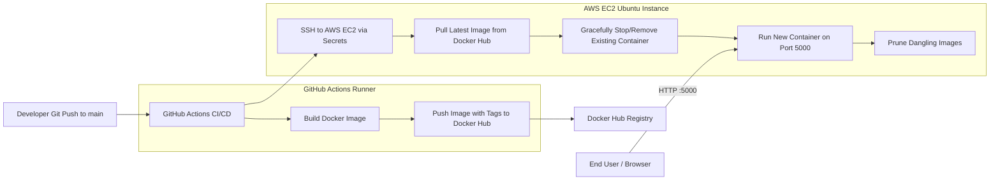

# Production-Ready Code-to-Cloud Automated CI/CD Pipeline

A fully automated, production-grade DevOps CI/CD pipeline built with **Python Flask**, **Docker**, **GitHub Actions**, and **AWS EC2**.


---

## 🏗️ Architecture Overview



---

## 📁 Repository Structure

```
.
├── .github/
│   └── workflows/
│       └── deploy.yml          # Automated CI/CD Pipeline (Build, Push & SSH Deploy)
├── .dockerignore               # Optimizes build context & prevents credential leaks
├── .gitignore                  # Prevents committing sensitive files & virtualenvs
├── Dockerfile                  # Multi-stage/security-hardened slim container image
├── app.py                      # Flask Application with / and /health endpoints
├── requirements.txt            # Python dependencies (Flask, Gunicorn)
└── README.md                   # Complete architectural and setup guide
```

---

## 🔒 Security Best Practices Implemented

1. **Non-Root Container User**: Runs under `appuser` (UID 10001) instead of `root`.
2. **Minimal Attack Surface**: Uses `python:3.11-slim` with `--no-cache-dir`.
3. **Docker Layer Caching**: Separates dependency installation from source code copying.
4. **Secrets Management**: Credentials (Docker Hub token, SSH private key) are managed strictly via GitHub Encrypted Secrets.
5. **Disk Hygiene**: Automated pruning of dangling images (`docker image prune -f`) on EC2 prevents disk full outages.
6. **Container Healthcheck**: Configured native `/health` check in Dockerfile.

---

## 🚀 Step-by-Step Deployment Guide

See the walkthrough guide for the complete checklist to configure AWS EC2, GitHub Secrets, and run the pipeline live today.
